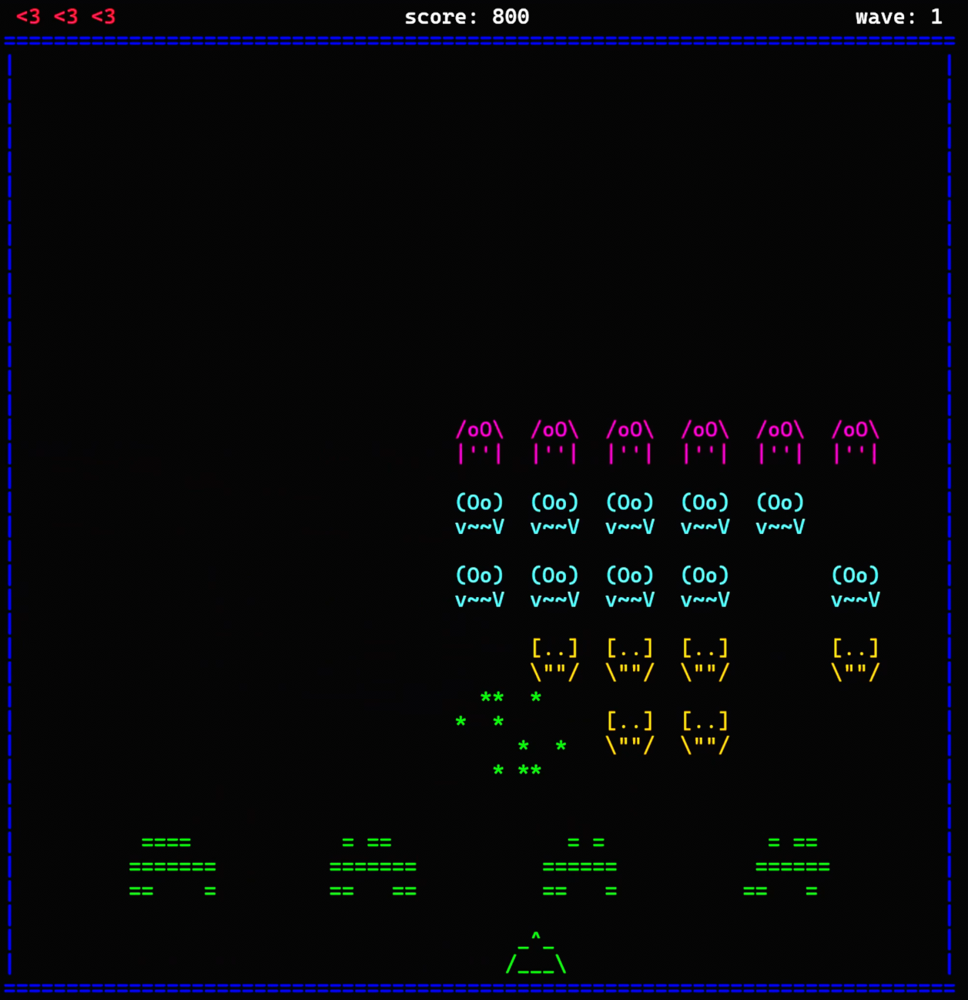
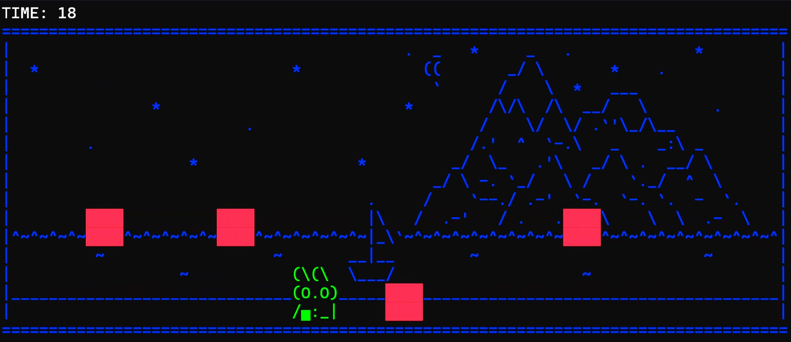
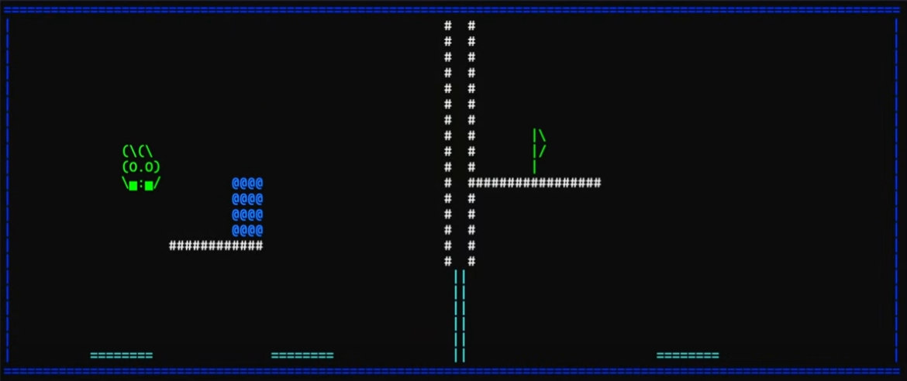

# Terme Examples

Some demo games developed usinng [Terme](https://github.com/nico-bertoli/terme), the terminal game engine I developed.

Trailer available [here](https://www.youtube.com/watch?v=TqpGVI95oNU&ab_channel=Nicol%C3%B2Bertoli)   

#
This project uses SFML for handling sounds: https://www.sfml-dev.org

SFML is developed by Laurent Gomila and contributors.
Copyright (C) 2007-2023 Laurent Gomila - laurent@sfml-dev.org
SFML is licensed under the zlib/libpng license.
